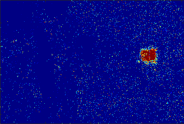
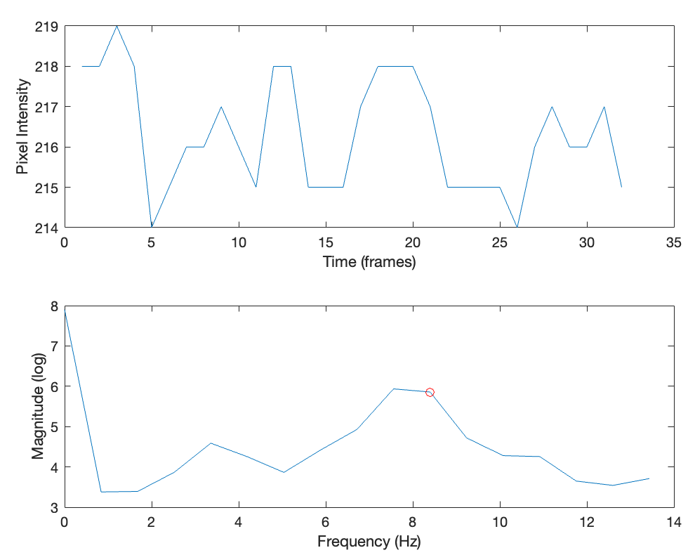

# Motion Detection in Video using FFT

This is a MATLAB script that detects motion in a video by computing the Fast Fourier Transform (FFT) of the pixel intensities over time. The algorithm detects the light of a strobe flashlight in a bright room by identifying the presence of a specific frequency of interest in the spectrum of the pixel intensities.

### How it Works
The script loads a video file and loops over the video frames in windows of a specified size and step. For each window, it downscales the frames by a specified factor, converts them to grayscale, and computes the FFT of the pixel intensities over time.

The frequency of interest is specified by the variable f and is converted to an index in the FFT spectrum by dividing the frequency by the frames per second and multiplying by the window size. The index is then rounded to the nearest integer and added to 1 to account for the DC component.

The algorithm then calculates the image by dividing the spectrum of the pixel intensities at the frequency of interest by the mean spectrum at all other frequencies. This normalizes the spectrum and highlights the frequency of interest.

The image is thresholded using a signal-to-noise ratio (SNR) threshold specified by the variable snr_threshold. Pixels with an SNR below the threshold are set to 0, while pixels with an SNR above the threshold are set to 1.

### Requirements
This script requires MATLAB and the Image Processing Toolbox.

### How to Use
To use this script, simply run the code in MATLAB and specify the file path of the video file to be analyzed. You can adjust the window size, step, downscaled size, frequency of interest, and SNR threshold by modifying the corresponding variables in the script.

### Examples
Here are two examples of motion detection using this script. The first shows the raw video and the second shows the motion detection output.

Raw Video and Motion Detection

Spectrum Plot

